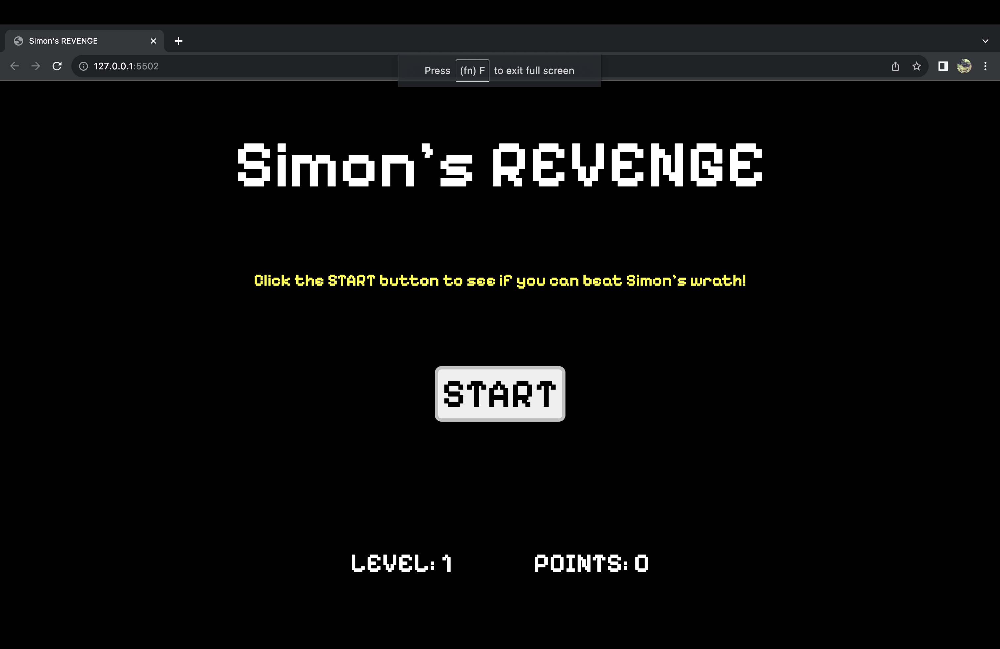
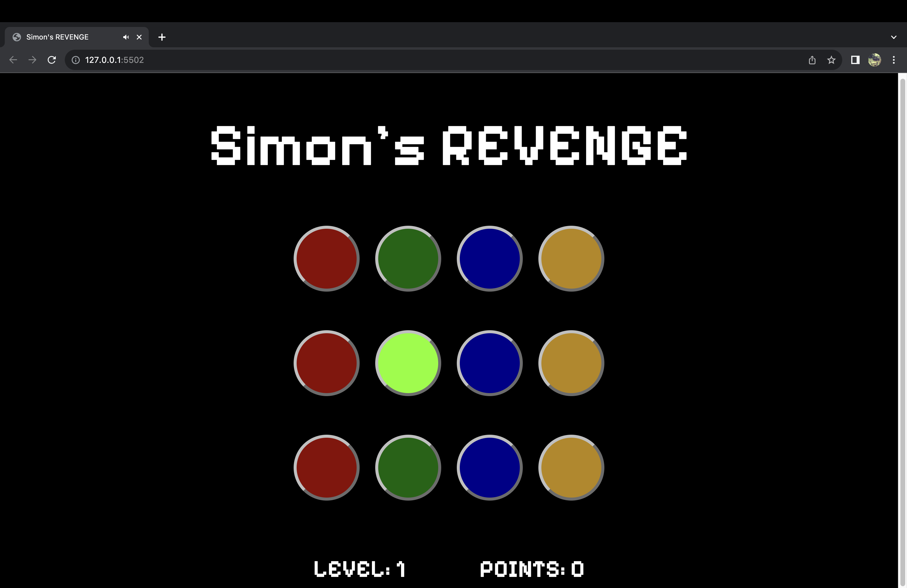

Simon's REVENGE

Simon's Revenge is a humble sequel to the original "Simon" game relased in 1978. Like the original, this is a short term-memory game, with the only difference
being the addition of more buttons; the original only having 4 whereas, this version has 12.

Simon was originally released in 1978 by the Milton Bradley Company which was then aquired by Hasbro in 1980. Since Hasbro's purchase; many variations of the game have been produced over the decades but, the princple game play has remained the same. 

The relative playability of the game is simple. The game will flash a certain sequence of buttons randomly and then the player must mimic the pattern correctly in order to proceed to the next level. If the player fails to match the game's pattern, the game will reset to it's original starting point. 

Start Screen

Game Dashboard

Technologies Used:

JavaScript
HTML
CSS

Link:

https://brad1995.github.io/Simon-s-REVENGE/

How to Play:

To start the game, click the START button in the center of the start-up page. Follow the sequenceses of flashing buttons for each level until you win the game. 

Planned Future Enhancements:

Like the original game, a timer or each level will be added along with a "strict button/mode". As of now, the game could be considered being in a "permanent strict mode". Stict Mode was an option given to the player in the original game where they could choose if they wanted each level to be a "one chance only" for the entirety of the game. If they got one level wrong, they would lose all points and the game would start over. With strict mode being off, it gave the player more fexability for mistakes. If they player got a sequence wrong, they would simply recieve an error sound and would have try to guess the sequence again before moving to the next level. 

